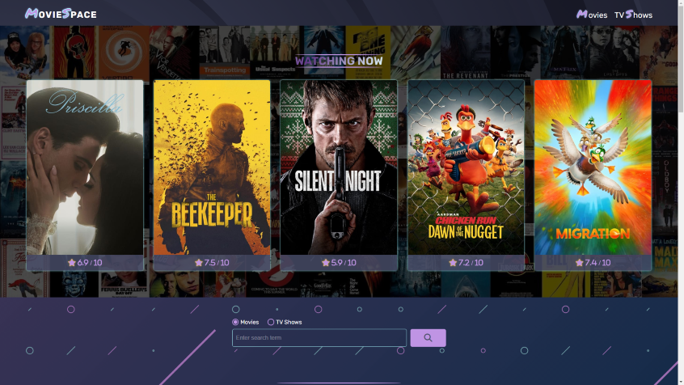

<h1 align="center">MovieSpace WebApp</h1>

#### What has been implemented:

- responsive design for mobile/tablet devices
- the webapp requires an API key from [_**The Movie Database**_](https://themoviedb.org/) (TMDB) to fetch data
- stlyle preprocessing: SCSS
- javascript code has been split into separate files using in the script tag `type = "module"`
- using `switch` statement in the `init()` function allows you to navigate between pages in the webapp
- using mobile touch slider `swiper` to display content in the loop (repo link => [_**swiper**_](https://github.com/nolimits4web/swiper))
- using `fetch API` to fetch data from the _**'TMDB'**_
- switching between `movie` and `tv` term in the search input
- **`noscript`** tag activates when javascript is disabled on your browser and display the message
<!-- - switch dark/light theme cklicking button with animation -->
- click here to visit => [_**MovieSpace WebApp**_](https://movietvspace.netlify.app/)

---

    

        
    

